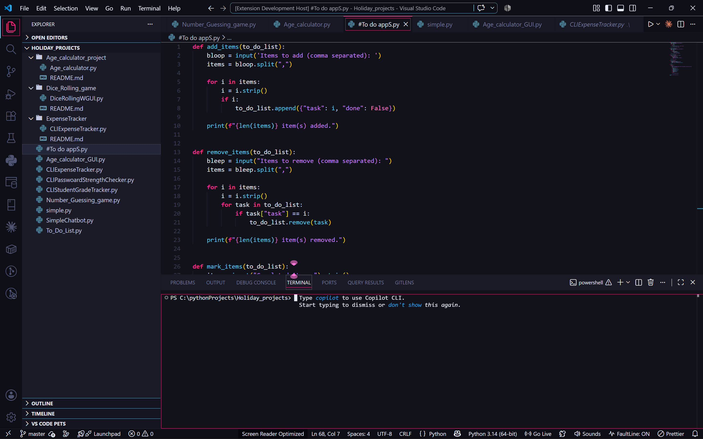

# Midnight Orchid for Visual Studio Code

A dark, sleek, and high-contrast VS Code theme with a hint of luxury. **Midnight Orchid** combines rich purples, dark obsidian charcoals, electric violet layers, and vivid magenta and cyan highlights to create an immersive, low-eyestrain editing environment.

---

## Preview



## 🎨 Palette Breakdown

| Role | Color | Hex |
| :--- | :--- | :--- |
| **Editor Canvas** | Midnight Slate | `#11121A` |
| **Panels & Sidebars** | Obsidian Purple | `#1A1B26` |
| **Foreground / Text** | Ice White | `#E6EBF8` |
| **Primary Accent** | Vivid Magenta | `#F72585` |
| **Secondary Accent** | Electric Violet | `#7209B7` |
| **Highlight & Cursor** | Cyan Glow | `#4CC9F0` |

---

## ✨ Features

* **High Contrast Readability:** Carefully balanced token contrast engineered to reduce eye strain during late-night coding sessions.
* **Glow Accents:** Cyan cursor and active selection borders designed to guide your focus effortlessly.
* **Vivid Syntax Highlighting:** Distinct scopes for functions, types, strings, and control flow across modern languages (JavaScript, TypeScript, Python, Rust, HTML/CSS, and more).
* **Unified Workbench UI:** Clean distinction between active editor space, sidebars, activity indicators, and integrated terminals.

---

## 🚀 Installation

### Option 1: VS Code Marketplace
1. Open **VS Code**.
2. Go to **Extensions** (`Ctrl+Shift+X` or `Cmd+Shift+X`).
3. Search for `Midnight Orchid`.
4. Click **Install**.
5. Click **Set Color Theme** (or press `Ctrl+K Ctrl+T` and select **Midnight Orchid**).

### Option 2: Quick Open
1. Press `Ctrl+P` or `Cmd+P` inside VS Code.
2. Paste the following command and press Enter:
   ```bash
   ext install your-publisher-name.midnight-orchid